# Application QCM en Python

Description

Une application interactive de Questionnaires à Choix Multiples (QCM) écrite en Python. Elle permet aux étudiants de répondre à des QCM et aux professeurs de gérer les résultats des étudiants. L'application est conçue pour être facile à utiliser, avec une interface en ligne de commande et des fonctionnalités distinctes pour les étudiants et les professeurs.

---

## 🚀 Fonctionnalités

### **Espace Étudiant**

- Inscription et connexion: Les étudiants peuvent créer un compte et se connecter pour accéder aux QCM.
- Réalisation de QCM par catégorie: Les étudiants peuvent choisir parmi différentes catégories de QCM et répondre aux questions.
- Affichage de l'historique des QCM réalisés: Les étudiants peuvent consulter leur historique de QCM, y compris les scores et les réponses fournies.
- Visualisation des réponses correctes et des scores: Après avoir terminé un QCM, les étudiants peuvent voir les réponses correctes et leur score.

### **Espace Professeur**
- Connexion au compte Professeur: Les professeurs peuvent se connecter à un compte dédié pour accéder aux fonctionnalités de gestion.
- Visualisation des résultats des étudiants: Les professeurs peuvent consulter les résultats de tous les étudiants, y compris les scores et les réponses.
- Ajout de nouveaux QCM : Les professeurs peuvent ajouter de nouveaux QCM avec des questions et des réponses, en choisissant entre des questions à choix unique ou multiple. 

---

## 🛠️ Prérequis

- **Python 3.x** : Assurez-vous d'avoir une version de Python installée sur votre système.

- **Bibliothèques utilisées** :  L'application utilise uniquement des modules standard de Python, donc aucune installation supplémentaire n'est nécessaire.

---

## 📦 Installation

1. Clonez le dépôt :

            git clone https://github.com/votre-utilisateur/votre-repo.git

2. Accédez au répertoire du projet :
            cd votre-repo

3. Exécutez l'application :
            python qcm_app.py

---
## ⚙️ Structure du Projet
   - qcm_app.py : Le fichier principal de l'application qui contient la logique de l'application.
   - qcms.json : Fichier JSON contenant les QCM disponibles, organisés par catégories et titres.      
   - users.json : Fichier JSON stockant les informations des utilisateurs (étudiants et professeurs).
   - history.json : Fichier JSON contenant l'historique des QCM réalisés par les étudiants.
   - scores.json : Fichier JSON stockant les scores cumulés des étudiants.
   - README.md : Fichier de documentation décrivant le projet.

--
## 📋 Utilisation
1. Espace Étudiant :

  - Inscrivez-vous ou connectez-vous.
  - Choisissez une catégorie et un QCM à réaliser.
  - Répondez aux questions et consultez votre score à la fin.
  - Consultez votre historique pour voir vos résultats précédents.

2. Espace Professeur :

  - Connectez-vous en tant que professeur en utilisant un compte dédié.
  - Consultez les résultats des étudiants.
  - Ajoutez de nouveaux QCM en suivant les instructions à l'écran.

---

## 📂 Exemples de fichiers JSON 
 - qcms.json : Contient les QCM disponibles, organisés par catégories et titres.

 - users.json : Stocke les informations des utilisateurs (étudiants et professeurs).

 - history.json : Contient l'historique des QCM réalisés par les étudiants.

 - scores.json : Stocke les scores cumulés des étudiants.

---

## 🖥️ Captures d'écran

### Menu Principal
Voici une capture d'écran du menu principal de l'application QCM :
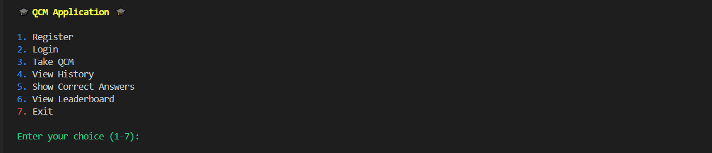

Le menu principal permet aux utilisateurs de choisir entre différentes options, telles que :
- **Register** : S'inscrire en tant qu'étudiant.
- **Login** : Se connecter à un compte existant.
- **Take QCM** : Répondre à un QCM.
- **View History** : Consulter l'historique des QCM réalisés.
- **Show Correct Answers** : Voir les réponses correctes d'un QCM.
- **View Leaderboard** : Consulter le classement des étudiants.
- **Exit** : Quitter l'application.

### Interface de Connexion (Étudiant)
Voici une capture d'écran de l'interface de connexion pour les étudiants :
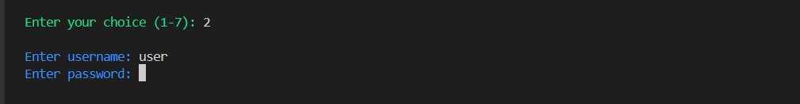
Les étudiants peuvent entrer leur nom d'utilisateur et leur mot de passe pour accéder à leur compte.

### Interface d'Inscription (Étudiant)
Voici une capture d'écran de l'interface d'inscription pour les nouveaux étudiants :
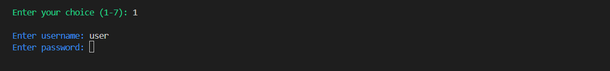
Les nouveaux étudiants peuvent créer un compte en entrant un nom d'utilisateur et un mot de passe.

### Liste des Catégories de QCM
Voici une capture d'écran de la liste des catégories de QCM disponibles :
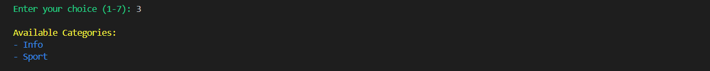
Les étudiants peuvent choisir une catégorie pour accéder aux QCM correspondants.

### Liste des QCM dans une Catégorie
Voici une capture d'écran de la liste des QCM disponibles dans une catégorie :
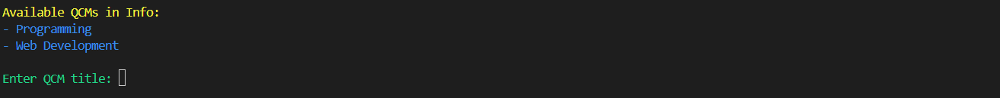
Les étudiants peuvent choisir un QCM spécifique pour commencer le quiz.

### Exemple de QCM en Cours
Voici une capture d'écran d'une question pendant un QCM :
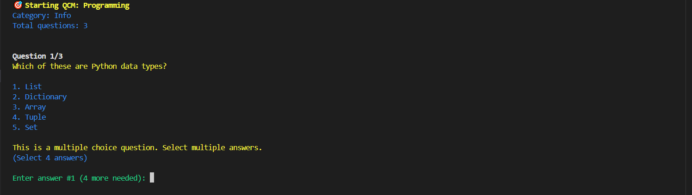
Les étudiants peuvent répondre aux questions en choisissant parmi les options proposées.

### Résultats après un QCM
Voici une capture d'écran des résultats après avoir terminé un QCM :
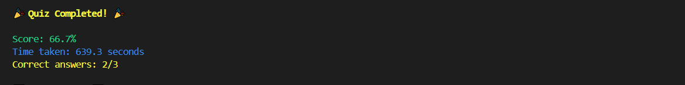
Les étudiants peuvent voir leur score, le nombre de réponses correctes et le temps pris pour terminer le QCM.

### Historique des QCM Réalisés
Voici une capture d'écran de l'historique des QCM réalisés par un étudiant :

Les étudiants peuvent consulter leur historique pour voir les QCM qu'ils ont déjà terminés, avec les dates et les scores.

### Interface de Connexion (Professeur)
Voici une capture d'écran de l'interface de connexion pour les professeurs :
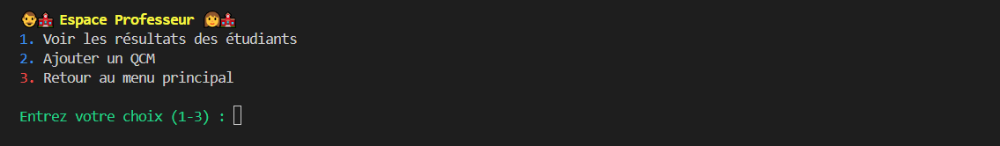
Les professeurs peuvent se connecter pour accéder aux fonctionnalités de gestion des QCM et des résultats.

### Visualisation des Résultats des Étudiants
Voici une capture d'écran de l'interface où les professeurs peuvent voir les résultats des étudiants :
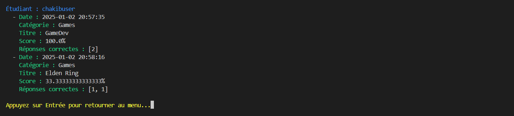
Les professeurs peuvent consulter les scores et l'historique des QCM réalisés par chaque étudiant.

### Ajout d'un Nouveau QCM
Voici une capture d'écran de l'interface où les professeurs peuvent ajouter un nouveau QCM :
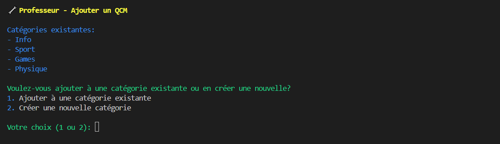
Les professeurs peuvent créer de nouveaux QCM en ajoutant des questions, des options et les réponses correctes.

### Leaderboard (Classement des Étudiants)
Voici une capture d'écran du classement des étudiants basé sur leurs scores :
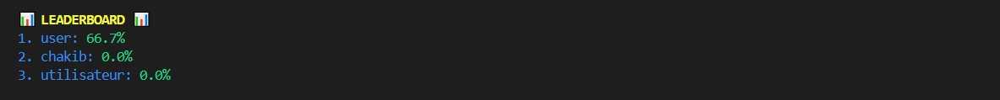
Les étudiants et les professeurs peuvent consulter le classement pour voir les meilleurs scores.

### Exemple de Fichier JSON
Voici une capture d'écran d'un exemple de fichier JSON utilisé dans l'application :
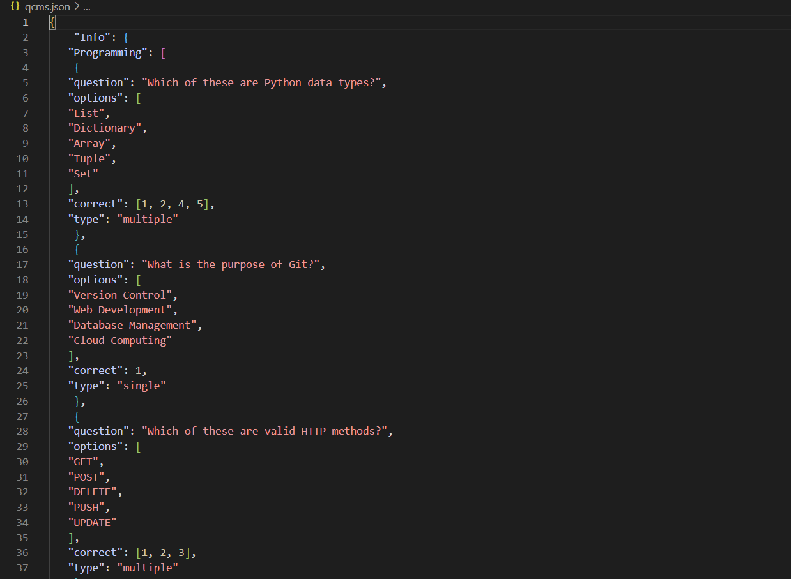
Les fichiers JSON stockent les QCM, les utilisateurs, les résultats et les scores.

### Affichage des Réponses Correctes
Voici une capture d'écran de l'interface où les étudiants peuvent voir les réponses correctes après un QCM :
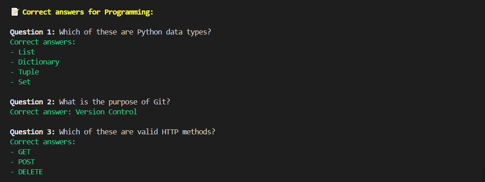
Les étudiants peuvent consulter les réponses correctes pour comprendre leurs erreurs.

## 📜 Contribuer

- Les contributions sont les bienvenues ! Si vous souhaitez contribuer à ce projet, veuillez suivre les étapes suivantes :
  1. Forkez le projet.
  2. Créez une branche pour votre fonctionnalité (git checkout -b feature/NouvelleFonctionnalité).
  3. Committez vos changements (git commit -m 'Ajout d'une nouvelle fonctionnalité').
  4. Poussez vers la branche (git push origin feature/NouvelleFonctionnalité).
  5. Ouvrez une Pull Request.
  

